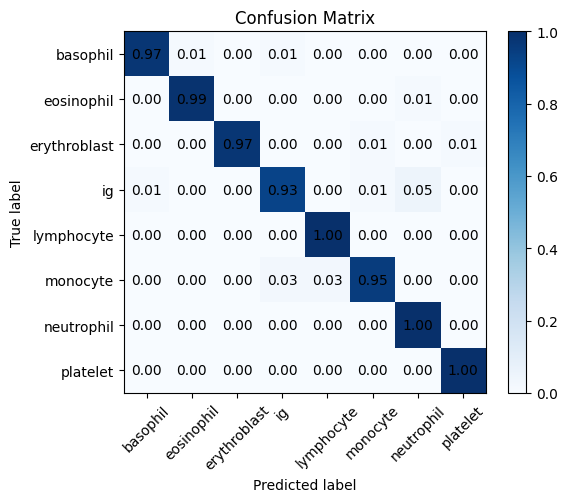
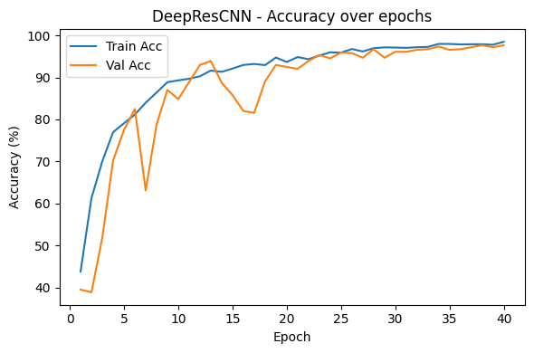

# Deep Residual SE-CNN for Microscopic Blood-Cell Classification

An image classifier for **8 blood-cell types** (basophil, eosinophil, erythroblast, immature granulocyte, lymphocyte, monocyte, neutrophil, platelet) trained **from scratch** (no pre-trained weights) on 3,200 labelled microscope images, with a 6-page conference-style paper.

**Paper:** [`report/Blood_Cell_Classification_Report.pdf`](report/Blood_Cell_Classification_Report.pdf)

## Model
**DeepResCNN**: residual convolutional blocks with **Squeeze-and-Excitation (SE)** channel attention and the **Mish** activation (about 11M parameters), compared against two baselines (an MLP on flattened pixels and a shallow 2-layer CNN).

## Training set-up
- Stratified 80/20 split (2,560 train / 640 validation), seed 42
- Heavy augmentation (random resized crop, horizontal and vertical flips and more) plus a class-balanced sampler
- Adam-family optimiser with cosine-annealing LR, batch size 32, 40 epochs, best-epoch checkpointing

## Results (validation set, 640 images)
| Model | Validation accuracy |
|---|---|
| MLP baseline | stalled near chance (loss stays at about ln 8) |
| SmallCNN baseline | about 77% |
| **DeepResCNN** | **97.66%** (macro-F1 0.98, best epoch 38) |

The weakest class was *immature granulocyte* (recall 0.93, often confused with neutrophils); lymphocytes, neutrophils and platelets were classified almost perfectly. The paper also reports ablations of the residual, SE and Mish components.

**Limitations.** The reported figure is **validation** accuracy, and the best epoch was chosen on that same set, so it is slightly optimistic; there is no separate labelled test score here. One seed and one split. The model is relatively heavy for the task (about 11M parameters), and the MLP baseline probably needed tuning (learning rate / normalisation) to be a fair comparison.

## Skills demonstrated
PyTorch, CNN / ResNet design, attention (SE blocks), custom activations, augmentation and class balancing, baseline and ablation studies, medical-image classification, writing a research-style paper (ICLR template).

## Run
`pip install -r requirements.txt`; add the course-supplied image folders (`train/<class>/*.jpg`, `test/`) and `class_map.json` (not included), then run the notebook (GPU recommended).

## Context
Built as an individual assessment for *Deep Learning Fundamentals* in the MSc in Artificial Intelligence & Machine Learning at the University of Adelaide (Trimester 3, 2025). Task text embedded in the notebook is the course template; the implementation and write-up are my own. Course datasets and material zips are not redistributed.

## Licence
MIT. See [LICENSE](LICENSE).
